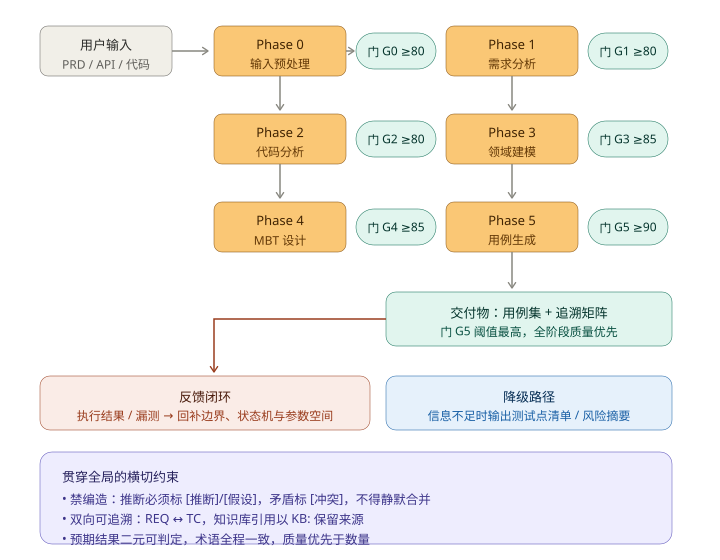
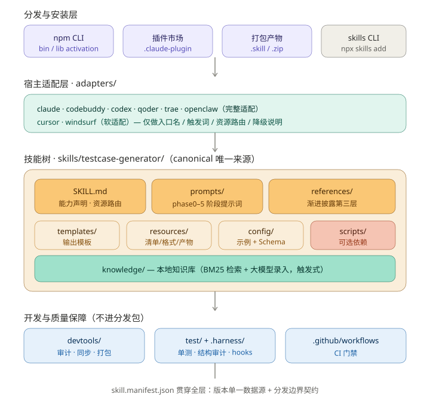
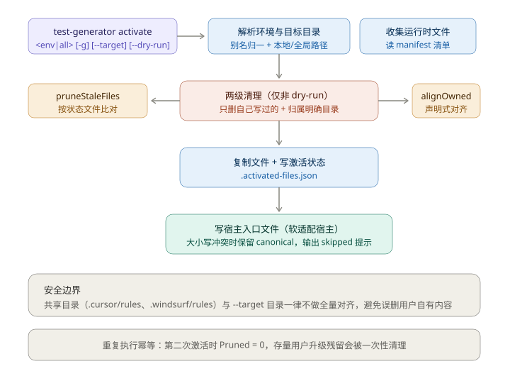
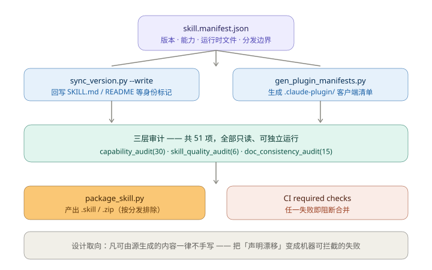

<p align="center">
  
</p>

# Test Generator v2.3.0 · AI 驱动的测试用例生成 Skill

<p align="center">
  <strong>🔬 让大模型真正"写出能跑"的测试用例</strong><br>
  <em>基于 MBT 方法论的六阶段智能流水线 · Agent Skills 标准布局 · 一键激活到 26 个主流 AI 宿主</em>
</p>

<p align="center">
  <a href="#-why"><strong>Why</strong></a> ·
  <a href="#-what"><strong>What</strong></a> ·
  <a href="#-how"><strong>How</strong></a> ·
  <a href="#-特性">特性</a> ·
  <a href="#-安装与下载">安装与下载</a> ·
  <a href="#-快速开始">快速开始</a> ·
  <a href="#-架构">架构</a> ·
  <a href="#-使用指南">使用指南</a> ·
  <a href="#-多宿主支持">多宿主</a> ·
  <a href="#-质量保障">质量保障</a>
</p>

<p align="center">
  <a href="https://www.npmjs.com/package/@wychmod-cn/testcase-generator-skill"></a>
  
  
  
  
  <a href="https://github.com/wychmod/test-generator/stargazers"></a>
</p>

<p align="center">
  <strong>GitHub Topics:</strong>
  <code>testing</code> ·
  <code>testcase-generation</code> ·
  <code>mbt</code> ·
  <code>model-based-testing</code> ·
  <code>test-automation</code> ·
  <code>quality-assurance</code> ·
  <code>automation</code> ·
  <code>claude-code</code> ·
  <code>codex</code> ·
  <code>ai-driven</code> ·
  <code>testing-tool</code> ·
  <code>skill</code>
</p>

---

## 🤔 Why · 为什么会有这个项目

测试工程师每天面临三个绕不开的痛点：

| 痛点 | 现状 | 期望 |
|---|---|---|
| **用例产出慢** | 4 小时/功能,迭代跟不上 | **15 分钟内一版能用** |
| **AI 生成用例不敢用** | 幻觉严重、覆盖率不可控 | **结构化、可追溯、可评审** |
| **多工具协作成本高** | Claude / Codex / Qoder / Cursor 各玩各的 | **一套 Skill 26 个宿主通用** |

**Test Generator 把"AI 生成测试用例"从 demo 拉到工程级**——不是 prompt 调优的玩具,
是基于 ISTQB MBT 方法论,带质量门禁、双向追溯、反馈闭环的生产级方案。

---

## 🎯 What · 它是什么

**Test Generator** 是一个面向 AI Agent 的 **Agent Skill 包 + 六阶段流水线框架**。

它做的事情可以一句话概括:

> 把"一段需求描述 / 一份 PRD / 一份 API 规范 / 一段代码"作为输入,
> 通过 **六阶段流水线(输入预处理 → 需求预处理 → 代码分析 → 领域建模 → MBT 设计 → 用例生成)**,
> 输出 **结构化、可评审、可追溯**的测试用例。

它**不是一个独立 CLI 工具**,而是一个 **Skill 包**——安装后会被注入到你正在使用的 AI 宿主
(Claude Code / Codex / Qoder / CodeBuddy / Cursor / Windsurf / OpenClaw / Trae)中,
让宿主 AI 按照这套方法论帮你生成用例。

技能内容按 **Agent Skills 标准布局**放在 `skills/testcase-generator/`,因此支持标准布局的
客户端(如 Claude Code)**克隆仓库或安装后即可自动发现**,无需任何额外激活步骤;
`test-generator activate` 则负责其余不读标准布局的宿主。

---

## ⚙️ How · 它怎么工作

<p align="center">
  
</p>

每一阶段都有独立 prompt + 质量门禁 + 双向追溯,而不是把一切都丢给大模型自由发挥。
门禁阈值随阶段递增(80 → 90)。信息不足时不强行出全量用例,而是走**降级路径**输出测试点清单与风险摘要。

📖 **架构详解见** [docs/architecture/](./docs/architecture/) |
**六阶段产出物详解** [skills/testcase-generator/resources/output_artifacts.md](./skills/testcase-generator/resources/output_artifacts.md)

---

## ✨ 特性

### 🏗️ 生产级架构
- **六阶段流水线**:输入预处理 → 需求预处理 → 代码分析 → 领域建模 → MBT 设计 → 用例生成
- **质量门禁系统**:关键阶段完成后可进行质量检查与一致性校验
- **双向可追溯**:需求 ↔ 测试用例之间可建立追溯矩阵
- **反馈闭环**:支持根据执行结果、漏测场景和规则修正持续优化产物

### 🧠 智能 AI 能力
- **多格式输入**:支持需求文档、PRD、API 规范、源代码、自然语言描述等输入
- **输入质量预处理**:在正式分析前先做规范化、质量评分与缺口识别
- **歧义与风险识别**:帮助发现模糊需求、边界遗漏、潜在冲突与测试盲区
- **代码与契约辅助分析**:可从实现细节、接口契约和数据流中反推测试点
- **本地知识库检索**:支持术语表、项目规范、历史用例等 Markdown 知识条目的触发式 BM25 检索,并在用例追溯中保留 `KB:` 引用
- **增量代码扫描**:支持从 unified diff 中提取新增代码行,辅助判断 PRD 对齐情况并识别硬编码密钥、裸 `except`、动态执行、SQL 拼接等风险信号

### 📊 专业测试工程
- **MBT 方法论**:围绕领域模型、状态迁移、覆盖准则组织测试设计(对齐 ISO/IEC/IEEE 29119-3:2021)
- **边界值 + 等价类**:系统化支持 BVA / EP / 决策表等分析方法
- **状态机推导**:自动构建状态转换规格与路径集合
- **参数空间优化**:支持 Pairwise、组合裁剪与风险导向覆盖
- **结构化输出**:生成便于评审、追踪和复用的测试设计产物

### 🎯 多场景覆盖
- **正向 / 负向**:Happy Path 与异常场景结合
- **接口 / 领域 / 状态**:适用于 API、业务流程、状态型系统测试
- **回归 / 审计 / 标准化**:适合测试补齐、测试审计、统一格式化输出
- **自动化适配**:可为后续 Pytest / Playwright / Cucumber 等自动化落地提供基础骨架
- **多宿主一键激活**:`test-generator activate all` 可一次性激活 Claude / Codex / Qoder / OpenClaw / Trae / CodeBuddy / Cursor / Windsurf

### 📚 v2.2.0 新增能力
- **知识库辅助层**:新增 `skills/testcase-generator/knowledge/`,可维护项目术语、规范、历史用例和合规规则;支持 `build_index.py` 构建本地索引、`search.py` 检索命中片段、`ingest.py` 接入用户自定义 LLM 命令录入知识
- **Phase 2 增量分析辅助**:新增 `skills/testcase-generator/scripts/incremental_code_scan.py`,可对 diff / patch 做新增行解析、PRD 需求 ID 匹配和潜在缺陷雷达输出
- **文档中心**:新增 `docs/`,集中维护架构、开发、发布、质量与 changelog 文档,根目录只保留分发必需入口
- **激活体验优化**:npm CLI 支持 `activate all`,并保留 `activate <environment>`、`-g`、`--dry-run` 等单平台能力

### 🧱 v2.3.0 新增能力(当前版本)
- **Agent Skills 标准布局**:技能内容迁入 `skills/testcase-generator/`,客户端可**自动发现**,不再依赖自定义激活流程;仓库根只保留分发元数据、适配层与开发工具
- **原生插件安装通路**:新增 `.claude-plugin/plugin.json` + `marketplace.json`,Claude Code 可一行 marketplace 安装,取代"先 `npm i` 再 `activate`"两步通路
- **版本单一数据源**:`skill.manifest.json` 的"版本"是唯一来源,`devtools/sync_version.py --write` 回写全部身份标记;插件清单同样由 `devtools/gen_plugin_manifests.py` **生成**,不再手工维护
- **渐进披露层**:新增 `skills/testcase-generator/references/`,把交付协议、质量评审动作、知识库消费规则从入口下沉按需加载;`SKILL.md` 正文**瘦身 35%**
- **进程内自检**:Node 单测新增适配路由与测试发现守卫;Python 测试 15 → 38 例;CI 引入 **Node 18 / 20 / 22 矩阵**,让 `engines: >=18` 的声明真正被验证
- **三层审计扩至 50+ 项**:`capability_audit`(30)+ `skill_quality_audit`(6)+ `doc_consistency_audit`(20 起,随告警增多),其中 `docs/` 与 npm 发布载荷首次被纳入机器守卫
- **发布载荷收口**:npm `files` 由裸目录改为精确条目,发布体积 **216.8 kB → 165.8 kB**(未压缩 636.2 → 472.7 kB),不再夹带 `__pycache__` 与本地索引
- **面向 AI agent 的根 `AGENTS.md`**:Codex / Cursor / Copilot / Gemini CLI / Windsurf 等 20+ 工具原生读取

---

## 👥 Who is this for · 谁适合用

✅ **强烈推荐使用**

- 🧪 **测试工程师 / QA Lead** — 想把 AI 用到测试设计,但担心幻觉和不可控
- 💻 **全栈 / 后端开发** — 写完代码想快速补一组高质量测试,不想从零设计
- 🤖 **AI Agent 实践者** — 用 Claude Code / Codex / Cursor 等做开发,想让 AI 按规范走流程
- 📋 **PM / 业务分析师** — 想在需求阶段就识别模糊点和漏测风险

⚠️ **谨慎使用**

- 完全没有测试基础概念的纯小白(本 Skill 假设使用者懂基本测试术语)
- 不接受 AI 辅助、纯手写党(本项目就是为 AI 协作设计的)

---

## 📦 安装与下载

四条通路,**按你的宿主挑一条**即可(可以叠加,互不冲突)。

### 通路一:Claude Code 原生插件(**推荐**)

Claude Code 支持 Agent Skills 标准布局与插件市场,这是**唯一不需要任何激活步骤**的安装方式
——技能会被自动发现。两条命令,先加市场再装插件:

```bash
claude plugin marketplace add wychmod/test-generator
claude plugin install testcase-generator@wychmod-testcase-generator
```

安装后插件名是 `testcase-generator`,市场名是 `wychmod-testcase-generator`
(格式为 `<owner>-<包名>`,不要写反)。

<details>
<summary>遇到问题时先自检</summary>

```bash
# 校验清单元数据是否合规
claude plugin validate .

# 确认市场已加入
claude plugin marketplace list
```

`claude plugin validate .` 会优先校验 `.claude-plugin/marketplace.json`。
若报 `No manifest found in directory`,说明当前目录不是本项目根目录。

</details>

### 通路二:Vercel skills CLI(跨宿主)

适合非 Claude 宿主,或想直接吃 GitHub 上的最新主干:

```bash
npx skills add https://github.com/wychmod/test-generator -y
```

### 通路三:npm CLI + 激活(**26 个宿主通用**)

装 npm 包,再用 `test-generator` 命令把技能运行时文件复制到各宿主目录:

```bash
# 全局安装(推荐,之后在任何目录都能调用)
npm i -g @wychmod-cn/testcase-generator-skill

# 一次性激活全部 26 个宿主
test-generator activate all
```

只想激活单个平台就换个环境名:

```bash
test-generator activate claude
test-generator activate codex
test-generator activate qoder
test-generator activate openclaw
test-generator activate trae
test-generator activate codebuddy
test-generator activate cursor
test-generator activate windsurf
```

先看看会写哪些文件、不落盘:

```bash
test-generator activate claude --dry-run
test-generator environments
```

`activate` 会**声明式对齐**目标目录:重复执行是幂等的,旧版本残留的过期文件会被清理,
共享目录(如 `.cursor/rules`、`.windsurf/rules`)与 `--target` 指定的目录不会被误删。

### 通路四:本地产物导入(离线 / 内网)

发布产物是 `.skill`(标准)与 `.zip`(兼容),两者内容一致。从 GitHub Releases 下载后,
在支持导入的宿主中直接导入:

```text
testcase-generator.skill
testcase-generator.zip
```

也可以先克隆仓库,再走通路一(仓库根就是插件根):

```bash
git clone https://github.com/wychmod/test-generator.git
cd test-generator
claude plugin marketplace add ./
```

### 该选哪一条

| 你的情况 | 选通路 | 是否需要激活 |
|---|---|---|
| 用 Claude Code | 一 | 否,自动发现 |
| 用 Cursor / Windsurf / Qoder 等 | 二 或 三 | 二不需要,三需要 |
| 内网、无法访问 GitHub / npm | 四 | 视宿主而定 |
| 想固定版本、可回滚 | 三 或 四 | 三需要 |

> **两种安装语义不同,别混用。** 通路一是"客户端按标准布局发现技能";
> 通路三的 npm 入口是把技能文件**复制**到宿主目录,不会改变 `.skill` / `.zip` 产物,
> 也不会让宿主去读 `skills/`。宿主缓存了旧版 `SKILL.md` 时,重新跑一次 `activate` 即可。

---

## 🚀 快速开始

### 基本用法

```bash
# 最简方式 — 一句话描述
/testcase-generator 为用户登录功能生成测试用例

# 基于文件
/testcase-generator ./requirements/order-system.md

# 指定选项
/testcase-generator --format=gherkin --priority=P0,P1 支付模块完整测试

# 完整配置
/testcase-generator --config=./config/example-config.json 订单管理系统全量测试

# 参考本地知识库
/testcase-generator 参考知识库,按项目规范生成登录密码强度测试用例

# 针对代码变更做回归设计
/testcase-generator 根据本次 diff 和 PRD 生成优惠券模块回归测试
```

### 适合什么输入

你可以直接提供以下任一类输入:

- 一段自然语言需求描述
- PRD / 需求文档路径
- 模块名、子系统名、业务流程名
- 接口说明、字段定义、状态流转规则
- 源代码或代码目录

输入越完整,生成结果通常越稳定;但即使输入不完整,也会先尝试识别缺口、补齐上下文并提示风险。

---

## 🌐 多宿主支持

v2.3.0 起,本 Skill 支持一键激活到 **26 个 AI 宿主**:

| 宿主 | 适配方式 | 激活命令 |
|---|---|---|
| **Claude Code** | 完整适配 | `test-generator activate claude` |
| **Codex** | 完整适配 | `test-generator activate codex` |
| **Qoder** | 完整适配 | `test-generator activate qoder` |
| **CodeBuddy**(腾讯云 AI 代码助手) | 完整适配 | `test-generator activate codebuddy` |
| **OpenCode** | 完整适配 | `test-generator activate opencode` |
| **Command Code** | 完整适配 | `test-generator activate commandcode` |
| **Trae** | 完整适配 | `test-generator activate trae` |
| **Cline** | 完整适配 | `test-generator activate cline` |
| **Roo Code** | 完整适配 | `test-generator activate roo` |
| **Kilo Code** | 完整适配 | `test-generator activate kilocode` |
| **Gemini CLI** | 完整适配 | `test-generator activate gemini` |
| **Qwen Code** | 完整适配 | `test-generator activate qwen` |
| **Kiro** | 完整适配 | `test-generator activate kiro` |
| **Factory Droid** | 完整适配 | `test-generator activate droid` |
| **Goose**(Block) | 完整适配 | `test-generator activate goose` |
| **OpenHands** | 完整适配 | `test-generator activate openhands` |
| **GitHub Copilot** | 完整适配 | `test-generator activate githubcopilot` |
| **Amp**(Sourcegraph) | 完整适配 | `test-generator activate amp` |
| **Google Antigravity** | 完整适配 | `test-generator activate antigravity` |
| **Pi** | 完整适配 | `test-generator activate pi` |
| **MCPJam** | 完整适配 | `test-generator activate mcpjam` |
| **Zencoder** | 完整适配 | `test-generator activate zencoder` |
| **OpenClaw** | 兼容适配 | `test-generator activate openclaw` |
| **Clawdbot** | 兼容适配 | `test-generator activate clawdbot` |
| **Cursor** | 软适配(`.cursorrules`) | `test-generator activate cursor` |
| **Windsurf** | 软适配(`.windsurfrules`) | `test-generator activate windsurf` |

> **收录标准**:仅登记**有宿主官方文档佐证**的技能目录路径;第三方 CLI 的汇总清单
> (如 Vercel `add-skill` 的 25 个 agent)只用于交叉核对,不作为收录依据。
> 完整路径表与兼容性细节见 [`HOST_COMPATIBILITY.md`](./HOST_COMPATIBILITY.md)。
>
> 想全部激活?一行命令搞定:
>
> ```bash
> test-generator activate all
> ```

---

## 🏛️ 架构

### 分层架构

<p align="center">
  
</p>

`skill.manifest.json` 是贯穿全层的契约文件——版本唯一数据源 + 分发边界定义,
被 `lib/activation.js`、`package_skill.py` 与审计脚本共同读取。

### 整体流程

<p align="center">
  
</p>

### 六阶段详解

| 阶段 | 名称 | 核心产出 | 关键能力 |
|------|------|---------|---------|
| **Phase 0** | 输入预处理 | 输入质量评估 + 规范化建议 | 缺口识别、输入增强、质量评分 |
| **Phase 1** | 需求预处理 | 结构化需求 + 可测需求 + 边界条件 | 需求抽取、冲突检测、NFR 分析 |
| **Phase 2** | 代码分析 | 代码结构 + 数据流 + 缺陷雷达 | 静态分析、契约推导、并发与风险识别 |
| **Phase 3** | 领域建模 | 领域模型 + 状态机 + 参数空间 | 实体建模、状态完备性验证、组合优化 |
| **Phase 4** | MBT 设计 | 测试模型 + 覆盖准则 + 路径集 | 风险导向设计、覆盖裁剪、错误猜测 |
| **Phase 5** | 用例生成 | 用例集 + 套件摘要 + 追溯矩阵 | 结构化用例生成、去重、产物汇总 |

### 多 Agent 划分参考(不入包)

想把六阶段流水线拆成多个 Agent 跑?仓库在 [`docs/architecture/agent-division/`](./docs/architecture/agent-division/README.md) 提供了一套可直接参照的划分方案:**编排者**(输入路由 / 门禁判定 / 回退与降级) + **P0-P5 六个阶段 Agent**(七节同构契约:身份 / 输入契约 / 执行流程 / 输出契约 / 质量门禁 / 降级与交接) + **独立评审 Agent**(裁判席三原则、verdict 协议、最低交付协议),并附 30 项产物契约字典与 ID 命名空间对照。方法论一律指针式引用技能树提示词,不复制内容;该模块属于开发文档,**不进入** `.skill` / `.zip` / npm 分发包。

### 宿主激活流程

`test-generator activate` 把技能运行时文件声明式地对齐到宿主目录:

<p align="center">
  
</p>

两级清理是升级路径的关键:仅靠状态文件无法覆盖"从未装过状态文件的存量用户",
因此对**归属明确**的目录再做一次声明式对齐。共享目录与 `--target` 目录一律只按状态文件精确删。

### 单一数据源与三层审计

<p align="center">
  
</p>

凡可由源生成的内容一律不手写——版本号、插件清单都是**生成物**,
再由三层审计(声明 30 / 内容 6 / 结构 20+)与 CI 门禁收敛,把"声明漂移"变成机器可拦截的失败。

> 结构层的检查项数是**动态的**:所有检查都通过时每类归并为一行,出现告警时会按类别展开成多行。因此文档只承诺下界(20),不写死具体数字——写死必然漂移。

---

## 📖 使用指南

### 适用场景

| 场景 | 推荐命令 | 配置建议 |
|------|---------|---------|
| 新功能首次测试 | `/testcase-generator [功能描述]` | `--depth=full` |
| 迭代回归测试 | `/testcase-generator --format=json [变更描述]` | `--priority=P0,P1` |
| API 契约测试 | `/testcase-generator openapi.yaml` | 重点查看契约与边界分析 |
| 状态流专项分析 | `/testcase-generator [业务流程]` | 重点查看 Phase 3 / Phase 4 |
| 合规交付 | `/testcase-generator [需求文档] --traceability=full` | 确保追溯矩阵完整 |
| 知识库辅助生成 | `/testcase-generator 参考知识库 [功能描述]` | 先用 `skills/testcase-generator/knowledge/scripts/search.py` 检索相关规范或历史用例 |
| 增量回归分析 | `/testcase-generator [diff/patch + PRD]` | 可先运行 `skills/testcase-generator/scripts/incremental_code_scan.py` 获取新增行、需求对齐与风险信号 |

### 输出格式选择

| 格式 | 命令参数 | 适用场景 |
|------|---------|---------|
| Markdown(默认) | `--format=markdown` | 正式文档交付、人工评审 |
| Gherkin/BDD | `--format=gherkin` | 敏捷团队、Cucumber/Behave |
| JSON | `--format=json` | CI/CD 集成、工具链处理 |

### 测试深度选择

| 深度 | 参数 | 用例数量(估) | 用时(估) | 适用时机 |
|------|------|-------------|---------|---------|
| Smoke | `--depth=smoke` | 5-15 | 5-10 min | 每次 CI 构建 |
| Standard | `--depth=standard` | 30-100 | 20-60 min | 每日/每周构建 |
| Full | `--depth=full` | 100-300 | 1-3 hr | 版本发布前 |
| Exploratory | `--depth=exploratory` | 50-150 | 1-2 hr | 安全/性能专项 |

---

## 📦 输出产物

典型输出会覆盖多个阶段,常见包括:

```text
test-output/
├── phase1/
│   ├── 01_requirements_summary.md
│   ├── 02_testable_requirements.md
│   └── 03_boundary_conditions.md
├── phase2/
│   ├── 01_code_structure.md
│   ├── 02_data_flow_analysis.md
│   └── 03_defect_radar.md
├── phase3/
│   ├── 01_business_domain_model.md
│   ├── 02_state_machine_spec.md
│   └── 03_test_parameter_space.md
├── phase4/
│   ├── 01_test_model_specification.md
│   ├── 02_state_transition_graph.md
│   └── 03_coverage_criteria.md
├── phase5/
│   ├── 01_testcase_collection.md
│   ├── 02_test_suite_summary.md
│   └── 03_traceability_matrix.md
└── quality_report.md
```

更完整的阶段产物说明可参考:[`skills/testcase-generator/resources/output_artifacts.md`](./skills/testcase-generator/resources/output_artifacts.md)。

---

## 📚 知识库

v2.2.0 引入本地知识库辅助层,用于保存生成测试用例时会反复参考的稳定信息,例如项目术语、命名规范、错误码约定、历史用例和合规规则。

v2.3.0 起它位于技能树内 `skills/testcase-generator/knowledge/`。**在技能树目录下执行**下列命令
(索引与检索脚本会按相对路径解析 `knowledge/`):

```bash
cd skills/testcase-generator

# 首次或修改 knowledge/sources 后重建索引
python knowledge/scripts/build_index.py --rebuild

# 检索规范、术语或历史用例
python knowledge/scripts/search.py "密码强度"
python knowledge/scripts/search.py "登录失败" --source historical-cases
python knowledge/scripts/search.py "支付回调" --json --top-k 5
```

录入新知识时,推荐复制 `knowledge/llm-ingest-template.md` 给大模型,让模型输出可索引 Markdown,再保存到 `knowledge/sources/<slug>.md`。使用知识库生成用例时,命令中写明"参考知识库""按规范""参考历史用例"即可;最终用例应在追溯引用中保留 `KB:` 来源。

> `knowledge/index.json` 是**本地构建产物**,不随包分发、不提交到 git,首次使用必须先在技能树目录下重建索引。

---

## 🔎 增量代码扫描

v2.2.0 引入 `skills/testcase-generator/scripts/incremental_code_scan.py`,用于 Phase 2 代码分析前的轻量辅助。它会解析 unified diff,提取新增行,尝试按 token overlap 匹配 PRD 需求,并标记常见高风险代码模式。

```bash
cd skills/testcase-generator
python scripts/incremental_code_scan.py --diff-file changes.patch --prd requirements/coupon.md
python scripts/incremental_code_scan.py --diff-file changes.patch --prd requirements/coupon.md --format markdown
```

该脚本不是完整静态分析器,适合在 PR / patch 语境中快速给出"本次变更影响了什么、可能漏测什么、哪些新增行需要重点回归"的结构化上下文。它是**可选依赖**:宿主不支持 Python 时会自动降级为纯文本分析。

---

## ⚙️ 配置

### 命令行参数速查

| 参数 | 缩写 | 说明 | 默认值 |
|------|-----|------|--------|
| `--format` | `-f` | 输出格式 | markdown |
| `--priority` | `-p` | 用例优先级过滤 | all |
| `--depth` | `-d` | 测试深度 | standard |
| `--output` | `-o` | 输出目录 | `./test-output/` |
| `--config` | `-c` | 配置文件路径 | 无 |
| `--lang` | `-l` | 输出语言 | auto |

### 配置文件示例

创建配置文件来自定义生成行为:

```json
{
  "project": { "name": "MyProject" },
  "generation": {
    "output_format": "markdown",
    "boundary_analysis": { "method": "robust" },
    "deduplication": { "enabled": true, "similarity_threshold": 0.85 }
  },
  "coverage": {
    "requirements_coverage_target": 100,
    "path_coverage_target": "critical+normal"
  },
  "quality": {
    "enable_gate_check": true,
    "strict_mode": false,
    "hallucination_detection": true
  }
}
```

详细配置见:

- [`skills/testcase-generator/config/example-config.json`](./skills/testcase-generator/config/example-config.json)
- [`skills/testcase-generator/config/testcase-config-schema.json`](./skills/testcase-generator/config/testcase-config-schema.json)

---

## 🛡️ 质量保障

### 质量门禁

关键阶段可结合质量检查机制进行审计,重点关注:

| 阶段 | 主要检查维度 | 参考阈值 |
|------|------------|---------|
| P0 输入预处理 | 输入完整性、格式规范性、缺口识别质量 | ≥ 80 分 |
| P1 需求预处理 | 完整性、准确性、可测试性、一致性 | ≥ 80 分 |
| P2 代码分析 | 分析范围、数据流、缺陷依据、需求对齐 | ≥ 80 分 |
| P3 领域建模 | 模型质量、状态机完备性、跨阶段一致性 | ≥ 85 分 |
| P4 MBT 设计 | 覆盖准则合理性、可操作性、设计完整性 | ≥ 85 分 |
| P5 用例生成 | 覆盖完整性、用例质量、去重效果、规范性 | ≥ 90 分 |

### 一致性审计

本项目对"声明 / 内容 / 结构"三层分别设防,任何改动都要让三层全绿才能合并。
三项都只读不写、可独立运行,也因此被接入 CI 作为 required check:

```bash
# 声明层:能力矩阵、必需路径、版本对齐与否
python devtools/capability_audit.py
python devtools/capability_audit.py --format json

# 内容层:Skill 标准字段、用例字段、阶段流水线、标准引用
python devtools/skill_quality_audit.py

# 结构层:文档之间的跨文件一致性
python .harness/scripts/doc_consistency_audit.py
```

三层审计合计 **50+ 项检查**(声明层 30 + 内容层 6 + 结构层 20 起),覆盖:

> 前两层项数固定;结构层项数动态(全绿时每类一行,出现告警按类别展开),故取**下界**表述。

- **声明层** —— `SKILL.md` / `README.md` / `skill.manifest.json` 的版本与能力声明是否一致;
  Prompt、模板、资源文件是否齐全;Schema 是否有效;示例配置是否能被 Schema 验证;
  反馈闭环与阶段产物资源是否存在;分发层关键文件是否齐全;版本标记是否漂移
- **内容层** —— Skill frontmatter 标准字段、用例必备字段、六阶段流水线完整性、
  标准引用规范(ISO/IEC/IEEE 29119 等)、陈旧版本字面量
- **结构层** —— 版本号在 `SKILL.md` / `README.md` / `manifest` 三处一致;宿主表与
  `adapters/` 与实际激活逻辑三方一致;npm 入口在文档中可查;入包边界的三份清单
  (`DISTRIBUTION.md` / manifest / `package_skill.py`)互不矛盾;
  `docs/` 内的技能树路径与相对链接可达;npm 发布载荷不夹带本地/生成物

### 测试与 CI

```bash
npm test            # Node 单测:激活解析、适配路由、测试发现守卫
npm run test:python # Python 单测:增量扫描、知识库、审计脚本
```

CI 分两个 job:**Guards (python)** 跑上述三项审计与 Python 测试,
**Node tests** 用 **18 / 20 / 22 三档矩阵**跑 Node 单测 —— 这个矩阵不是装饰,
`engines: >=18` 的声明正是靠它被真正验证。

---

## 📁 项目结构

```text
testcase-generator/
├── skills/
│   └── testcase-generator/               # 🔑 技能树(canonical，Agent Skills 标准布局)
│       ├── SKILL.md                      #   主入口(只做能力声明与路由)
│       ├── config/                       #   ⚙️ 配置示例与 JSON Schema
│       ├── prompts/                      #   📝 六阶段提示词 + 知识入库提示词
│       ├── references/                   #   📎 按需加载的补充参考(渐进披露第三层)
│       │   ├── delivery-protocol.md      #     最小交付协议、输出字段、交付深度
│       │   ├── quality-review.md         #     交付前必做的质量评审动作与边界
│       │   └── knowledge-base-usage.md   #     知识库录入、触发词与消费规则
│       ├── resources/                    #   📚 质量清单 / 格式参考 / 产物协议 / 反馈模板
│       ├── templates/                    #   📋 需求 / 状态图 / 测试用例模板
│       ├── scripts/                      #   🐍 prd_reader / incremental_code_scan
│       └── knowledge/                    #   📚 本地知识库(触发式 BM25)
│           ├── README.md                 #     使用说明
│           ├── llm-ingest-template.md    #     大模型知识录入模板
│           ├── sources/                  #     可检索 Markdown 知识条目
│           └── scripts/                  #     build_index / search / ingest 工具
│
├── AGENTS.md                             # 🤖 面向 AI agent 的仓库操作说明(≤100 行)
├── README.md                             # 📖 本文件
├── DISTRIBUTION.md                       # 📦 分发边界与发布检查项
├── HOST_COMPATIBILITY.md                 # 🧩 宿主兼容性说明
├── skill.manifest.json                   # 🗂️ 分发元数据与入包规则(版本的唯一数据源)
├── .claude-plugin/                       # 🔌 客户端插件清单(由 devtools 生成)
│   ├── plugin.json
│   └── marketplace.json
├── run_package.bat                       # 🛠️ Windows 打包入口
│
├── adapters/                             # 🔌 多宿主薄适配入口(不进技能树)
│   ├── claude/                           #   Claude / Anthropic 类宿主
│   ├── codex/                            #   Codex / 工程 CLI 类宿主
│   ├── codebuddy/                        #   CodeBuddy / 腾讯云 AI 代码助手
│   ├── cursor/                           #   Cursor (Anysphere) 软适配
│   ├── openclaw/                         #   OpenClaw / 兼容型宿主
│   ├── qoder/                            #   Qoder / IDE 集成类宿主
│   └── windsurf/                         #   Windsurf / Antigravity 软适配
│
├── bin/test-generator.js                 # ⌨️ npm CLI 入口(activate / environments)
├── lib/activation.js                     # 🔁 宿主激活逻辑与目标目录解析
│
├── docs/                                 # 🧭 内部文档中心(不进包)
│   ├── architecture/                     #   架构设计
│   ├── assets/diagrams/                  #   📊 架构 / 流程图 SVG(README 引用)
│   ├── development/                      #   开发指南
│   ├── operations/                       #   打包与发布
│   └── quality/                          #   质量与测试计划
│
├── test/                                 # ✅ Node 单测 + Python 审计测试(不进包)
│
├── devtools/                             # 🧪 开发与发布工具(不进包)
│   ├── capability_audit.py               #   声明层审计(30 项)
│   ├── skill_quality_audit.py            #   内容层审计(6 项)
│   ├── sync_version.py                   #   版本单一数据源同步器
│   ├── gen_plugin_manifests.py           #   客户端插件清单生成器
│   └── package_skill.py                  #   Skill 打包脚本
│
├── .harness/                             # 🧠 AI 协作宪法 / reins / 文档护栏(不进包)
│   └── scripts/doc_consistency_audit.py  #   结构层审计(15 项)
│
├── .github/workflows/ci.yml              # ✅ CI(审计 + Python 测试 + Node 18/20/22 矩阵)
│
└── test-output/                          # 🧾 本地测试输出示例(不参与分发)
```

> `skills/` 是**技能内容的唯一来源(canonical)**,必须被 git 跟踪;
> 而 `.claude/` `.codebuddy/` `.cursor/` 等宿主目录里的是 `activate` 生成的**镜像**,
> 已被 gitignore,不要手工编辑、也不要提交。

---

## 🔄 版本历史

> **v2.3.0 之前**与**之后**的路径不同。v2.3.0 是一次**破坏性重构**:技能内容从仓库根
> 迁入 `skills/testcase-generator/`,凡硬编码过 `prompts/`、`resources/`、`templates/`、
> `config/`、`scripts/`、`knowledge/` 根路径的外部脚本都要补上前缀。详见
> [`.harness/changelogs/v2.3.0.md`](./.harness/changelogs/v2.3.0.md)。

### v2.3.0 (2026-09)
- **Agent Skills 标准布局**:技能内容迁入 `skills/testcase-generator/`,客户端自动发现,不再依赖自定义激活流程
- **原生插件通路**:`.claude-plugin/plugin.json` + `marketplace.json`,支持 marketplace 一行安装
- **生成物取代手写**:插件清单由 `devtools/gen_plugin_manifests.py` 生成、版本标记由 `devtools/sync_version.py` 回写,消除手工漂移
- **`references/` 渐进披露层**:交付协议 / 质量评审 / 知识库用法从入口下沉,`SKILL.md` 正文瘦身 **-35%**
- **三层审计新增结构层守卫**:新增 `docs/` 技能树路径、`docs/` 相对链接、npm 发布载荷三项机器守卫,并全部并入 CI
- **CI 加固**:拆为审计与 Node 测试两个 job,后者引入 **Node 18/20/22 矩阵**;新增测试发现守卫,断言脚本与测试文件集合一致
- **发布载荷收口**:npm `files` 由裸目录改为精确条目,体积 216.8 kB → 165.8 kB,不再夹带 `__pycache__` 与本地索引
- **激活器对齐清理**:重复激活幂等,旧版本残留的过期文件自动清理,共享目录与 `--target` 目录不误删
- **宿主适配扩至 26 个**:在原有 8 个宿主基础上新增 OpenCode、Command Code、Cline、Roo Code、Kilo Code、Gemini CLI、Qwen Code、Kiro、Factory Droid、Goose、OpenHands、GitHub Copilot、Amp、Google Antigravity、Pi、MCPJam、Zencoder、Clawdbot。仅登记**有官方文档佐证**的路径;第三方 agent 清单只作交叉核对
- **单一数据源收敛**:新增 `devtools/manifest.py` 作为 manifest 唯一访问层,`package_skill.py` / `capability_audit.py` / `doc_consistency_audit.py` / `gen_plugin_manifests.py` 不再各自 `json.load`
- **`docs/**` 显式进入分发排除**:此前仅靠运行时白名单的副作用被排除,现由 `skill.manifest.json` 与 `DISTRIBUTION.md` 双向声明
- **根 `AGENTS.md`**:面向 AI coding agent 的仓库操作说明,20+ 工具原生读取

### v2.2.0 (2026-06-15)
- 新增 `skills/testcase-generator/knowledge/` 本地知识库:支持项目术语、项目规范、历史用例、API 速查和合规规则的 Markdown 化管理
- 新增 BM25 本地检索工具:`build_index.py`、`search.py`,支持触发词检索、source 过滤、JSON 输出和 Top-K 命中片段
- 新增知识录入链路:`llm-ingest-template.md` 支持手动喂给大模型,`ingest.py` 支持通过用户配置的 LLM 命令自动写入 `knowledge/sources/`
- 新增 `skills/testcase-generator/scripts/incremental_code_scan.py`:支持 diff 新增行解析、PRD 需求 ID / token 对齐、潜在 bug 规则扫描和 Markdown / JSON 输出
- 新增 `docs/` 文档中心,补充架构、开发、发布、质量与 changelog 文档入口
- npm 激活命令支持 `test-generator activate all`,可一次性激活全部支持宿主;`--target` 保持为单平台激活专用

### v2.1.0 (2026-04)
- 新增 **Phase 0 输入预处理**,从五阶段升级为六阶段流水线
- 引入 `skill.manifest.json` 作为分发元数据与入包边界定义
- 新增 `DISTRIBUTION.md` 与 `HOST_COMPATIBILITY.md`,补充分发与兼容性说明
- 增加 `resources/output_artifacts.md`,承接阶段产物的详细定义
- 打包与审计工具迁移至 `devtools/`,区分运行时资产与开发工具
- 增加 `adapters/` 目录,为多宿主入口做统一收口
- 扩展适配器生态:
  - 新增 `adapters/codebuddy/SKILL.md`(腾讯云 CodeBuddy 完整适配)
  - 新增 `adapters/cursor/cursorrules.md`(Anysphere Cursor 软适配,激活时复制为 `.cursorrules`)
  - 新增 `adapters/windsurf/windsurfrules.md`(Codeium / Google Windsurf / Antigravity 软适配,激活时复制为 `.windsurfrules`)
  - `lib/activation.js` 支持环境从 5 个扩展到 8 个(`claude` / `qoder` / `codex` / `openclaw` / `trae` / `codebuddy` / `cursor` / `windsurf`)

### v2.0.0 (2026-04-04)
- 五阶段流水线架构 + 质量门禁系统
- 完整配置系统与模板/资源体系
- 歧义、冲突、幻觉等检测机制
- 双向追溯矩阵与测试用例去重能力

### v1.1.0
- 增加网络调研能力
- 增加模板系统和资源文件

### v1.0.0
- 五阶段基础流程

---

## 📄 License

MIT License © 2024-2026 Test Generator Team

---

## 👤 作者

**韦语轩 (wychmod)** — 长期关注 AI Agent 在企业研发流程中的工程化落地。

- 🌐 个人博客:[https://wychmod.github.io](https://wychmod.github.io)
- 📧 联系邮箱:`wychmod@foxmail.com`
- 💻 GitHub:[@wychmod](https://github.com/wychmod)
- 📦 NPM:[@wychmod-cn](https://www.npmjs.com/~wychmod-cn)

---

## 🤝 贡献

我们欢迎任何形式的贡献:

- 🐛 **提 Issue** — bug 报告 / 功能建议 / 文档改进
- 🔀 **提 PR** — 代码 / 文档 / 测试 / 适配新 AI 宿主
- 💬 **Discussion** — 分享你的用例生成场景、最佳实践、踩坑经验
- ⭐ **Star** — 你的 Star 是这个项目持续迭代的最大动力

详细贡献指南见 [`docs/development/contributing.md`](./docs/development/contributing.md)。

---

## 🙏 致谢

- **ISTQB** — 国际软件测试认证委员会,MBT 标准方法论
- **ISO/IEC/IEEE 29119-3:2021** — 当前测试文档标准;IEEE 829 仅作为历史兼容参考
- **INCOSE** — 国际系统工程学会,需求工程实践
- **OWASP** — 开放 Web 应用安全项目,安全测试指南
- **所有贡献者** — 感谢每一位提交 Issue、PR 和讨论的同行 🙏

---

<p align="center">
  <sub>Built with ❤️ by Test Generator Team · 让 AI 真正写出能跑、能用、能信的测试用例</sub>
</p>

<p align="center">
  <a href="#-why"><strong>↑ 回到顶部</strong></a> ·
  <a href="https://github.com/wychmod/test-generator"><strong>⭐ Star 这个项目</strong></a>
</p>
