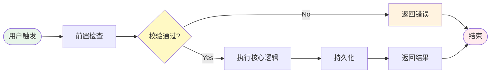

# 需求摘要模板 v2.0 (生产级)

> **模板版本**: 2.0.0 | **标准**: IEEE 830 + INCOSE + Agile hybrid | **用途**: Phase 1 需求预处理输出

---

```markdown
---
document_type: "requirements_summary"
template_version: "2.0.0"
generated_by: "testcase-generator v2.0.0"
project:
  name: "[项目名称]"
  code: "[项目代号]"
  version: "1.0.0"
  domain: "[领域: e-commerce/fin-tech/healthcare/education/etc]"
metadata:
  author: "AI Generator / [人工审核者]"
  status: "draft"  # draft / reviewed / approved / baseline
  created: "{YYYY-MM-DDTHH:mm:ssZ}"
  last_updated: "{YYYY-MM-DDTHH:mm:ssZ}"
  confidentiality: "internal"  # public / internal / confidential / restricted
  total_requirements: N
  confidence_level: "high|medium|low"
quality:
  completeness_score: {0-100}
  ambiguity_count: N
  conflict_count: N
change_history:
  - version: "1.0"
    date: "{date}"
    author: "AI Generator v2.0"
    change: "Initial creation"
sources:
  primary: "[主要输入源描述]"
  references: ["参考文档1", "参考文档2"]
---

# 需求规格说明书: [模块/功能名称]

## 文档控制

| 版本 | 日期 | 作者 | 变更描述 | 审批人 | 状态 |
|------|------|------|---------|--------|------|
| 1.0 | YYYY-MM-DD | AI Generator | 初始创建 | — | Draft |
| 1.1 | YYYY-MM-DD | [Reviewer] | [变更内容] | — | Reviewed |
| 2.0 | YYYY-MM-DD | [Approver] | [变更内容] | [Name] | Approved |

## 目录

1. [文档概述](#1-文档概述)
2. [总体描述](#2-总体描述)
3. [具体需求](#3-具体需求)
4. [非功能需求](#4-非功能需求)
5. [业务规则](#5-业务规则)
6. [数据约束](#6-数据约束)
7. [边界条件](#7-边界条件)
8. [假设与风险](#8-假设与风险)
9. [术语表](#9-术语表)
10. [附录](#10-附录)

---

## 1. 文档概述

### 1.1 目的
[本文档的目的：为[功能名称]提供完整的需求规格，作为测试设计和开发实现的依据。]

### 1.2 范围
```
┌─────────────────────────────────────────┐
│              ✅ 包含范围                 │
│                                         │
│  · [核心功能A的完整需求]                │
│  · [核心功能B的完整需求]                │
│  · [相关接口的数据约束]                │
│  · [用户角色和权限定义]                │
│                                         │
│              ❌ 不包含                  │
│                                         │
│  · [不在本次范围内的功能X]             │
│  · [其他系统的需求Y]                   │
│  · [底层基础设施细节]                  │
└─────────────────────────────────────────┘
```

### 1.3 定义与缩写

| 术语/缩写 | 全称/定义 | 来源 |
|----------|---------|------|
| [Term] | [Definition] | [Standard/Custom] |

### 1.4 参考资料

| 序号 | 资料 | 版本 | 来源 |
|------|------|------|------|
| 1 | [资料名称] | v.x.x | [URL/Path] |

---

## 2. 总体描述

### 2.1 产品概述

[用一段话概括产品的定位和核心价值]

**一句话描述**: [用最简洁的语言描述核心功能]

### 2.2 用户特征

| 角色ID | 角色名称 | 描述 | 典型使用场景 | 权限级别 |
|-------|---------|------|------------|---------|
| ROLE-[NNN] | [Role Name] | [详细描述] | [Scenario] | Admin/User/Guest/ReadOnly/API |

#### 权限矩阵

| 功能 \ 角色 | ROLE-001 | ROLE-002 | ROLE-003 |
|------------|----------|----------|----------|
| [功能A] | ✅ 创建/编辑/删除 | 🔍 只读 | ❌ 无权 |
| [功能B] | ✅ 完整操作 | ✅ 完整操作 | 🔍 只读 |

> 图例: ✅ = 有权限(含子操作) | 🔍 = 只读 | ❌ = 无权限 | ⚙️ = 部分权限

### 2.3 运行环境

| 环境维度 | 要求 |
|---------|------|
| 硬件环境 | [CPU/RAM/Storage requirements] |
| 软件环境 | [OS/Browser/Runtime versions] |
| 网络环境 | [Latency/Bandwidth requirements] |
| 外部依赖 | [Third-party services and their availability] |

### 2.4 设计约束

| 约束ID | 类型 | 描述 | 影响 |
|-------|------|------|------|
| CONSTR-001 | Technical | [技术约束] | [影响的功能点] |
| CONSTR-002 | Regulatory | [合规要求] | [必须满足的条件] |
| CONSTR-003 | Business | [商业约束] | [限制条件] |

---

## 3. 具体需求

### 3.1 功能分解

```
ROOT: [总体功能]
├── F-010: [一级模块 A]
│   ├── F-010-01: [子功能 A-1]
│   │   ├── F-010-01-01: [叶子功能] ← 可测试单元
│   │   └── F-010-01-02: [叶子功能]
│   └── F-010-02: [子功能 A-2]
├── F-020: [一级模块 B]
│   └── F-020-01: [子功能 B-1]
└── F-030: [跨模块/非功能]
```

### 3.2 核心业务流程

#### 主流程 (Happy Path)



#### 子流程清单

| 流程ID | 名称 | 触发条件 | 前置状态 | 后置状态 | 涉及角色 |
|-------|------|---------|---------|---------|---------|
| FLOW-[NNN] | [名称] | [trigger] | [pre-state] | [post-state] | [roles] |

### 3.3 功能需求条目化

---
## REQ-[NNN]: [需求标题]

### 基本信息

| 属性 | 值 |
|-----|---|
| 需求ID | REQ-[NNN] |
| 需求标题 | [Title] |
| 所属模块 | F-[XXX] |
| 需求类型 | Functional / Interface / Data / Business-Rule |
| 优先级 | P0(Must) / P1(Should) / P2(Could) / P3(Won't) |
| 来源追溯 | 原始输入第 X 段 / [User Story ID] |
| 状态 | Draft / Clarified / Confirmed / [需确认] |
| 复杂度 | Low / Medium / High / Critical |

### 需求描述 (SHALL 格式)

**系统应当 (SHALL)**:

1. **当** `[触发条件]`，**系统** `[执行的动作]`
2. **如果** `[条件A]`，**则** `[结果A]`；**否则** `[结果B]`
3. **在** `[时机]`，**系统必须** `[行为]`

> ⚠️ 使用 SHALL（必须）/ SHOULD（应当）/ MAY（可以）区分强制程度

### 用户故事格式 (可选)

```gherkin
As a [用户角色],
I want to [完成什么操作],
So that [获得什么价值/解决什么问题]
```

### 验收标准 (Acceptance Criteria)

| AC-ID | Given (前置) | When (触发) | Then (预期) | 验证方式 | 优先级 | 数据准备 | 状态 |
|-------|-------------|-------------|------------|---------|-------|---------|------|
| AC-[NNN]-01 | [前置状态和数据] | [操作/事件] | [可观测的结果] | Auto/Manual | P0-P3 | [data] | Ready/[需准备] |

**AC 编写规范**:
- ✅ 每个 AC 是**二元判定**的——只有 Pass 或 Fail
- ✅ 使用 Given-When-Then 结构
- ✅ 预期结果是**可观测、可度量**的
- ❌ 避免使用「正确」「合理」「适当」等主观词汇
- ❌ 避免「快速""高效"等不可量化的描述

### 业务规则关联

| 规则ID | 规则摘要 | 对本需求的影响 |
|-------|---------|--------------|
| BR-[NNN] | [summary] | [impact description] |

### 接口/数据需求

**输入**:
| 参数 | 类型 | 必填? | 约束 | 默认值 | 说明 |
|------|------|-------|------|-------|------|

**输出**:
| 字段 | 类型 | 条件 | 说明 |
|------|------|------|------|

### 假设与依赖

- **假设**:
  - [H-1]: `[假设内容及合理性说明]`
- **依赖**:
  - [D-1]: `REQ-[xxx]` 必须先实现
  - [D-2]: 外部服务 `[service]` 可用
- **排除**:
  - 本需求不包含: `[明确排除的范围]`

### 风险提示

| 风险ID | 描述 | 可能性 | 影响 | 缓解措施 |
|-------|------|-------|------|---------|
| RSK-[NNN] | [desc] | L/M/H | L/M/H | [mitigation] |

---

*(重复上述模板，列出所有 REQ)*

---

## 4. 非功能需求

### 4.1 性能需求

| 指标ID | 指标名称 | 目标值 | 测量方法 | 条件 | 优先级 |
|-------|---------|--------|---------|------|-------|
| NFR-PERF-001 | [指标] | [value] | [method] | [condition] | P0-P3 |

常见性能指标参考：
- **响应时间**: P50 < Xms, P95 < Yms, P99 < Zms
- **吞吐量**: ≥ N TPS/QPS under normal load
- **并发能力**: 支持 N 个并发用户
- **资源占用**: CPU < N%, Memory < N MB

### 4.2 安全需求

| 安全ID | 类别 | 需求描述 | 参考 | 优先级 |
|-------|------|---------|------|-------|
| NFR-SEC-001 | Auth | [描述] | OWASP ASVS | P0 |
| NFR-SEC-002 | Data-Protection | [描述] | GDPR/PIPL | P0 |
| NFR-SEC-003 | Access-Control | [描述] | CWE-xxx | P1 |

安全需求清单（必检项）：
- [ ] 认证机制（密码策略/MFA/Session管理）
- [ ] 授权控制（RBAC/ABAC）
- [ ] 输入验证（注入防护）
- [ ] 输出编码（XSS防护）
- [ ] 敏感数据加密（传输/存储）
- [ ] 审计日志（操作追踪）
- [ ] 错误处理（信息泄露防护）
- [ ] 速率限制（防暴力破解）

### 4.3 可用性需求

| 指标 | 目标值 | 说明 |
|------|-------|------|
| 系统可用性 | ≥ 99.9% (年度) | 年停机时间 < 8.76 小时 |
| RTO (恢复时间目标) | ≤ N 分钟 | 从故障到恢复的最大时间 |
| RPO (恢复点目标) | ≤ N 秒 | 最大可接受的数据丢失量 |
| 错误消息清晰度 | 所有错误都有用户可理解的提示 | — |

### 4.4 兼容性需求

| 维度 | 支持范围 | 备注 |
|------|---------|------|
| 浏览器 | Chrome ≥ N, Firefox ≥ N, Safari ≥ N, Edge ≥ N | 移动端另计 |
| 操作系统 | Windows 10+, macOS 12+, iOS 15+, Android 12+ | |
| 屏幕分辨率 | 最小 320px, 响应式适配 | |
| API 版本 | 向后兼容 N 个大版本 | |

### 4.5 可维护性需求

- [ ] 代码覆盖率目标 ≥ N%
- [ ] 日志级别和格式统一
- [ ] 配置外部化管理
- [ ] 健康检查端点 `/health`

---

## 5. 业务规则

| 规则ID | 规则名称 | 类别 | 触发条件 | 规则表达式/描述 | 违反后果 | 关联需求 |
|-------|---------|------|---------|---------------|---------|---------|
| BR-[NNN] | [Name] | Calc/Valid/Workflow/Perm/Temporal | [when] | [expression/desc] | [consequence] | REQ-xxx |

### 规则优先级与冲突解决

| 冲突对 | 规则A | 规则B | 冲突场景 | 解决方案 |
|-------|-------|-------|---------|---------|
| BR-x vs BR-y | [desc] | [desc] | [scenario] | [resolution] |

---

## 6. 数据约束

### 6.1 输入数据字典

| 字段名 | 数据类型 | 格式 | 是否必填 | 取值范围/枚举 | 默认值 | 约束条件 | 敏感度 |
|-------|---------|------|---------|--------------|-------|---------|-------|

### 6.2 输出数据字典

| 字段名 | 数据类型 | 格式 | 条件性 | 说明 |
|-------|---------|------|-------|------|

### 6.3 数据完整性规则

| 规则ID | 类型 | 描述 | 影响字段 |
|-------|------|------|---------|
| DIR-001 | Entity Integrity | 主键非空唯一 | id |
| DIR-002 | Referential Integrity | 外键引用存在 | foreign_key |
| DIR-003 | Domain Integrity | 值域符合定义 | constrained_field |
| DIR-004 | User-Defined | 自定义业务约束 | business_field |

---

## 7. 边界条件

### 7.1 数值边界

| 参数 | Min-1 | Min | Nominal | Max | Max+1 | 特殊值 |
|-------|-------|-----|---------|-----|-------|--------|
| [param] | [val] | [val] | [val] | [val] | [val] | NaN, Inf, -Inf, 0 |

### 7.2 字符串边界

| 参数 | Empty | 1-char | Normal | Max-len | Over-max | Special |
|-------|-------|--------|---------|----------|---------|---------|
| [param] | "" | "a" | "[normal]" | "[max]" | "[over]" | SQL/XSS/Unicode |

### 7.3 时间边界

| 参数 | Past-limit | Boundary | Future-limit | Invalid | Special |
|-------|-----------|---------|-------------|--------|---------|
| [param] | [date] | [date] | [date] | [format] | 闰年/夏令时/时区 |

### 7.4 枚举/集合边界

| 参数 | Empty-set | Single | Full-set | Invalid-member | Duplicate |
|-------|-----------|--------|-----------|---------------|----------|
| [param] | [] | [one] | [all valid] | [invalid] | dup items |

### 7.5 组合边界决策表

| 条件\规则 | R-01 | R-02 | R-03 | R-04 |
|----------|------|------|------|------|
| Cond1: [param1 OK?] | T | T | F | F |
| Cond2: [param2 OK?] | T | F | T | F |
| Action: [result] | ✅ | ⚠️ | ❌ | ❌❌ |

---

## 8. 假设与风险

### 8.1 假设列表

| 假设ID | 假设描述 | 合理性论证 | 如果假设不成立的应对 |
|-------|---------|-----------|-------------------|
| ASM-[NNN] | [assumption] | [rationale] | [contingency] |

### 8.2 风险登记册

| 风险ID | 描述 | 可能性 | 影响 | 风险等级 | 缓解策略 | 应急预案 |
|-------|------|-------|------|---------|---------|---------|
| RSK-[NNN] | [desc] | L/M/H | L/M/H | 🟢🟡🔴 | [mitigation] | [contingency] |

### 8.3 已知限制

| 限制ID | 描述 | 影响范围 | 后续计划 |
|-------|------|---------|---------|
| LIM-[NNN] | [limitation] | [scope] | [future plan] |

---

## 9. 术语表

| 术语 | 定义 | 同义词 | 首次出现位置 |
|------|------|-------|------------|
| [Term] | [Precise definition] | [Synonyms] | REQ-xxx |

---

## 10. 附录

### Appendix A: 原始需求引用
[保留原始输入的关键部分，便于追溯]

### Appendix B: 相关文档索引
- [相关设计文档链接]
- [API 文档链接]
- [数据库 Schema 链接]

### Appendix C: 变更记录

| 版本 | 日期 | 作者 | 变更类型 | 变更描述 | 影响分析 | 审批 |
|------|------|------|---------|---------|---------|------|
| 1.0 | date | Author | Creation | Initial | — | — |

---

## 审批签署

| 角色 | 姓名 | 日期 | 签字 | 备注 |
|------|------|------|------|------|
| 需求作者 | | | | |
| 技术审核 | | | | |
| 测试负责人 | | | | |
| 产品负责人 | | | | |
| 最终批准 | | | | |

---

*本文档由 testcase-generator v2.0 自动生成，遵循 IEEE 830 / INCOSE 标准。*
*请在使用前进行人工审核确认。*
