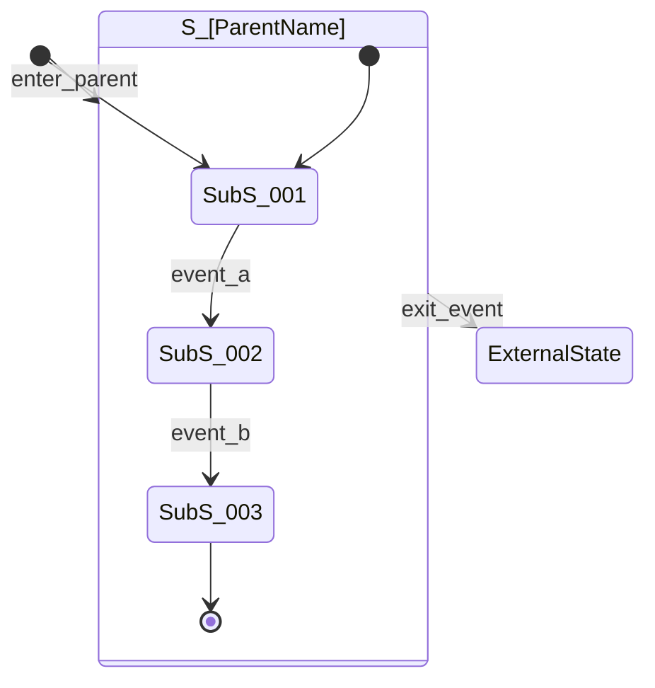
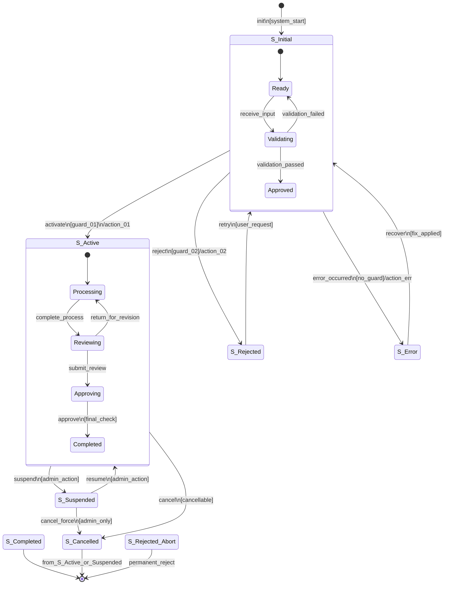
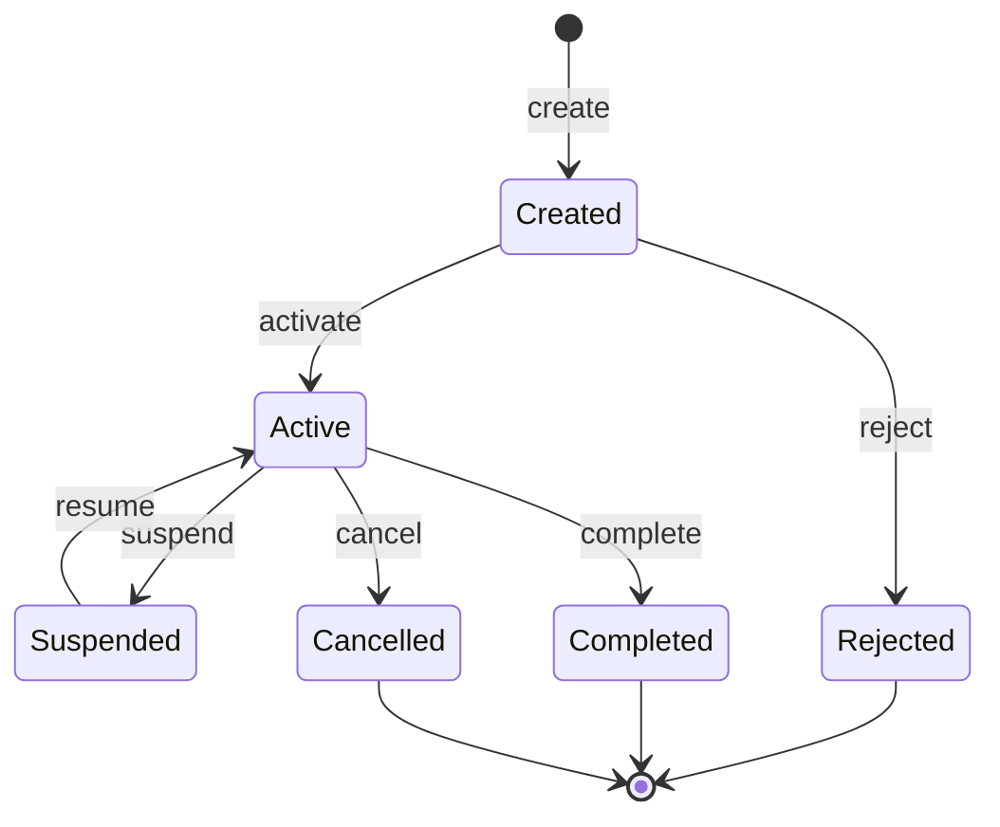

# 状态图模板 v2.0 (生产级)

> **模板版本**: 2.0.0 | **标准**: UML 2.5 State Machine + Harel Statecharts | **用途**: Phase 3 领域建模 / Phase 4 MBT 设计

---

```markdown
---
document_type: "state_machine_specification"
template_version: "2.0.0"
generated_by: "testcase-generator v2.0.0"
metadata:
  project_name: "[项目名称]"
  machine_name: "[状态机名称]"
  version: "1.0"
  status: "draft"
  created: "{date}"
  last_updated: "{date}"
  total_states: N
  total_transitions: N
  machine_type: "Mealy|Moore|Hybrid|Statechart"
  completeness_check: "PASSED|WARNINGS|FAILED"
---

# 状态机规格说明书: [StateMachineName]

## 文档控制

| 版本 | 日期 | 作者 | 变更内容 | 审批 |
|------|------|------|---------|------|
| 1.0 | YYYY-MM-DD | AI Generator v2.0 | 初始创建 | — |

---

## 1. 概述

### 1.1 基本元信息

| 属性 | 值 |
|-----|---|
| 状态机名称 | [Name] |
| 状态机类型 | Mealy (输出依赖转换) / Moore (输出依赖状态) / Hybrid / Statechart |
| 关联实体/对象 | ENT-[NNN] / TO-[NNN] |
| 建模目的 | 描述 [entity/object] 的完整生命周期行为 |
| 抽象层级 | Conceptual / Logical / Implementation |
| 触发依据 | REQ-[xxx] / CODE:[location] / [推断] |

### 1.2 范围与边界

```
✅ 本状态机描述的范围:
   · [实体/对象的完整生命周期]
   · 所有合法的状态变化路径
   · 每个状态的进入/退出行为

❌ 不包含:
   · [其他相关实体的内部状态]
   · [非状态变化的业务逻辑]
   · [UI层面的交互细节]
```

---

## 2. 状态定义

### 2.1 状态清单

| 状态ID | 状态名称 | 类型 | 类别 | 描述 | 允许停留? | 最大停留时间 | 入口动作 | 出口动作 | 来源追溯 |
|-------|---------|------|------|------|---------|------------|---------|---------|---------|
| S-[NNN] | [Name] | Initial/Final/Normal/Choice/Fork/Join/Composite/Sync | Active/Inactive/Transient | [Description] | Y/N | [duration] or ∞ | [entry action] | [exit action] | REQ/CODE/Infer |

**状态类型详解**:

| 类型 | 符号 | 定义 | 数量限制 | 特殊规则 |
|------|------|------|---------|---------|
| **Initial** | `[*]→` | 状态机的唯一入口点 | 恰好 1 个 | 无入口动作，只有出边 |
| **Final** | `→[*]` | 状态机的终止点 | ≥ 0 个 | 无出边，只有入口动作 |
| **Normal** | 圆角矩形 | 普通中间状态 | 无限制 | 可有入边和出边 |
| **Choice** | 菱形 | 根据条件选择分支 | 无限制 | 出边守卫条件应互斥且完备 |
| **Fork** | 黑条 | 并行分叉 | 无限制 | 所有出边同时触发 |
| **Join** | 黑条 | 并行汇合 | 无限制 | 所有入边都到达后才触发出边 |
| **Composite** | 虚线框 | 包含子状态的复合状态 | 无限制 | 可有自己的 entry/exit 和 internal transitions |
| **Sync** | 圆圈虚线 | 同步等待点 | 无限制 | 用于多区域同步 |

**状态类别详解**:

| 类别 | 说明 | 测试关注点 |
|------|------|-----------|
| **Active** | 稳定状态，系统可在此持续存在 | 验证状态持久化和恢复 |
| **Inactive** | 终态，不可再转移 | 验证终态的正确性 |
| **Transient** | 过渡状态，不应长时间停留 | 验证快速通过，无卡住风险 |

### 2.2 复合状态定义 (如有)

## Composite State: S-[NNN] [StateName]



| 子状态ID | 名称 | 描述 | 入口条件 | 出口条件 |
|---------|------|------|---------|---------|
| SubS-[NNN] | [name] | [desc] | [entry] | [exit] |

---

## 3. 转换定义

### 3.1 转换总表

| 转换ID | 源状态 | 目标状态 | 事件(Event) | 守卫条件(Guard) | 动作(Action) | 优先级 | 触发类别 | 概率估计 | 来源追溯 |
|-------|-------|---------|------------|----------------|------------|-------|---------|---------|---------|
| T-[NNN] | S-[src] | S-[dst] | E-[event_name] | `[condition]` | `[action]` | P1-P5 | Auto/External/Time/Internal | High/Med/Low | REQ/CODE |

**优先级说明**: 当同一状态下多个事件都可能触发时，按优先级选择。

**触发类别**:
- **Auto**: 自动触发（无外部事件）
- **External**: 外部事件驱动（用户操作/API调用）
- **Time**: 时间触发（超时、定时器）
- **Internal**: 内部转换（不改变当前状态，只执行动作）

### 3.2 守卫条件详细规格

## G-[NNN]: [GuardConditionName]

| 属性 | 值 |
|-----|---|
| 条件ID | G-[NNN] |
| 条件名称 | [Name] |
| 自然语言描述 | [清晰的中文或英文描述] |
| 形式化表达 | `[expression in pseudo-code or OCL]` |
| 涉及参数/变量 | `[param list]` |
| 计算复杂度 | Simple / Medium / Complex |
| 评估时机 | Event-triggered / Continuous / Periodic |
| 副作用? | No / Yes (⚠️ 注意) |

**示例表达**:

```pseudocode
-- 形式化示例
G-001: 用户有效且账户正常
  context User inv:
    self.isActive = true 
    and self.account.status = AccountStatus.NORMAL 
    and self.account.balance >= self.order.totalAmount

G-002: 在可取消时间窗口内
  context Order inv:
    (self.status = OrderStatus.PENDING or self.status = OrderStatus.PAID)
    and (currentDateTime - self.createdAt) < Duration.ofMinutes(30)
    and not self.shippingInfo.hasShipped()
```

### 3.3 动作详细规格

## A-[NNN]: [ActionName]

| 属性 | 值 |
|-----|---|
| 动作ID | A-[NNN] |
| 动作名称 | [Name] |
| 动作类型 | Entry / Exit / Transition / Internal / Do-Activity |
| 执行者 | System / External / Actor-[role] |
| 动作描述 | [详细的执行步骤描述] |
| 副作用列表 | [side effects if any] |
| 可回滚? | Yes(How) / No |
| 超时时间 | [timeout] or None |
| 重试策略 | None / Fixed(n) / Exponential(base, max) |

---

## 4. 完整状态转换图

### 4.1 Mermaid 图 (主图)



### 4.2 简化版状态图

> 用于文档概览和演示



---

## 5. 状态转换矩阵

### 5.1 完整矩阵

| 当前状态 \ 事件 | E1:init | E2:activate | E3:suspend | E4:resume | E5:complete | E6:cancel | E7:reject | E8:error | E9:recover |
|---------------|--------|-----------|-----------|----------|-----------|----------|----------|--------|-----------|
| **S-Initial** | — | →Active[G1]/A1 | — | — | — | — | →Reject[G2]/A2 | →Error/Aerr | — |
| **S-Active** | — | — | →Suspend/G3 | — | →Complete/A3 | →Cancel[G4]/A4 | — | →Error/Aerr | — |
| **S-Suspend** | — | — | — | →Active/A5 | — | →Cancel[A6] | — | — | — |
| **S-Complete** | — | — | — | — | — | — | — | — | — |
| **S-Cancelled** | — | — | — | — | — | — | — | — | — |
| **S-Reject** | →Init/A7 | — | — | — | — | — | — | — | — |
| **S-Error** | — | — | — | — | — | — | — | — | →Init[A8] |

格式说明：
- `→Target` = 无条件的确定转换
- `→Target[Guard]/Action` = 有守卫条件和动作的转换
- `—` = 此事件在该状态下无效（非法触发）
- 最终行/列的状态表示到达后不可转移

### 5.2 矩阵完备性验证

| 检查项 | 结果 | 详情 |
|-------|------|------|
| 每个非终态至少有一个出边? | ✅/❌ | |
| 初始状态有且仅有一个? | ✅/❌ | |
| 守护条件互斥且完备? | ✅/❌ | 对于 Choice 状态的出边 |
| 无孤立状态? | ✅/❌ | 所有状态都可达 |
| 无不可达状态? | ✅/❌ | 所有状态都可从初始状态到达 |

---

## 6. 动作定义汇总

### 6.1 入口动作

| 状态 | 动作ID | 动作描述 | 执行时机 | 是否异步 | 超时处理 |
|------|-------|---------|---------|---------|---------|
| S-[NNN] | A-[xxx] | [desc] | 进入状态时 | Y/N | [handler] |

### 6.2 出口动作

| 状态 | 动作ID | 动作描述 | 执行时机 | 是否必须成功 | 失败处理 |
|------|-------|---------|---------|------------|---------|
| S-[NNN] | A-[xxx] | [desc] | 离开状态时 | Yes/No | [handler] |

### 6.3 Do-Activity (持续活动)

| 状态 | Activity | 描述 | 中断策略 |
|------|----------|------|---------|
| S-[NNN] | [activity] | [desc] | Abort/Deferred/Complete-then-exit |

---

## 7. 异常状态处理

| 异常类型 | 触发条件 | 可能发生的当前状态 | 目标状态 | 处理动作 | 恢复路径 |
|---------|---------|-------------------|---------|---------|---------|
| Timeout | 操作超时 | S-Processing, S-Pending | S-TimeOut | log + notify | S-Processing (retry) 或 S-Cancelled |
| InvalidTransition | 非法状态转换请求 | Any | (保持原状态) | 返回错误信息 | 用户重新发起正确请求 |
| ResourceExhaust | 资源耗尽 | S-Active | S-Error | graceful degradation | S-Active (资源恢复后) |
| ConcurrencyConflict | 并发修改冲突 | S-Active | S-Conflict | 版本检查+合并提示 | S-Active (用户确认) |
| ExternalFailure | 外部服务失败 | S-Dependent | S-Degraded | 降级模式 | S-Normal (外部恢复后) |

---

## 8. 覆盖分析

### 8.1 状态覆盖目标

| 状态ID | 状态名 | 必须覆盖? | 已覆盖测试路径 | 覆盖次数 | 充余度 |
|-------|-------|---------|--------------|---------|--------|
| S-001 | [Name] | Yes/No | PATH-xxx, PATH-yyyy | N | ✅/⚠️ |

### 8.2 转换覆盖目标

| 转换ID | 转换名 | 必须覆盖? | 已覆盖测试用例 | 覆盖次数 | 充余度 |
|-------|-------|---------|-------------|---------|--------|

### 8.3 路径覆盖统计

| 路径ID | 路径序列 | 长度 | 覆盖状态 | 用例引用 |
|-------|---------|------|---------|---------|
| PATH-[NNN] | S0→S1→...→Sn | N | Covered/Not-Covered | TC-xxx |

### 8.4 覆盖缺口

| 未覆盖元素 | 类型 | 风险等级 | 补充建议 | 紧急程度 |
|-----------|------|---------|---------|---------|
| [element] | State/Trans | Critical/High/Med/Low | [suggestion] | Now/Next-Sprint/Backlog |

---

## 9. 与其他模型的关系

| 关联模型 | 关系类型 | 说明 |
|---------|---------|------|
| ERD (Phase 3) | 状态属性映射 | 状态值对应实体中的 status 字段 |
| Test Model (Phase 4) | 测试状态映射 | 业务状态 → 测试状态的对应关系 |
| Test Cases (Phase 5) | 覆盖映射 | 每条用例覆盖的状态转换序列 |

---

*本文档由 testcase-generator v2.0 自动生成。*
*请结合 Phase 4 的测试模型规格一起使用。*
