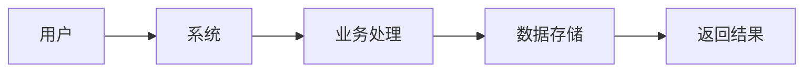

# 需求摘要模板

## 项目信息
| 字段 | 内容 |
|-----|------|
| 项目名称 | [project name] |
| 功能模块 | [module name] |
| 需求编号 | REQ-XXX |
| 版本 | 1.0 |
| 日期 | YYYY-MM-DD |

## 功能概述

### 一句话描述
[用一句话简洁描述核心功能]

### 详细描述
[详细描述功能背景、目的和范围]

## 用户角色

| 角色 | 描述 | 权限级别 |
|-----|-----|---------|
| [role1] | [desc] | [level] |
| [role2] | [desc] | [level] |

## 核心业务流程

### 主流程

### 子流程
| 流程ID | 流程名称 | 描述 |
|-------|---------|-----|
| F-001 | [name] | [desc] |
| F-002 | [name] | [desc] |

## 功能需求

### FR-XXX: [需求名称]
| 属性 | 内容 |
|-----|------|
| 需求类型 | 功能需求 |
| 优先级 | [P0/P1/P2/P3] |
| 状态 | [Draft/Reviewed/Approved] |

**描述**: [详细描述]

**验收标准**:
| ID | 条件 | 预期结果 | 可测试性 |
|----|------|---------|---------|
| AC-001 | [条件] | [结果] | [H/M/L] |
| AC-002 | [条件] | [结果] | [H/M/L] |

## 非功能需求

### 性能需求
| 指标 | 要求 | 说明 |
|-----|-----|-----|
| 响应时间 | [value] | [condition] |
| 并发数 | [value] | [condition] |

### 安全需求
- [需求1]
- [需求2]

### 兼容性需求
- [需求1]
- [需求2]

## 业务规则

| 规则ID | 规则描述 | 触发条件 | 约束 |
|-------|---------|---------|-----|
| BR-001 | [desc] | [condition] | [constraint] |
| BR-002 | [desc] | [condition] | [constraint] |

## 数据约束

### 输入数据约束
| 参数 | 类型 | 格式 | 约束 |
|------|-----|-----|-----|
| [field] | [type] | [format] | [rule] |

### 输出数据约束
| 字段 | 类型 | 格式 | 说明 |
|------|-----|-----|-----|
| [field] | [type] | [format] | [note] |

## 外部依赖

| 依赖项 | 类型 | 描述 | 接口 |
|-------|-----|-----|-----|
| [dep1] | [type] | [desc] | [api] |
| [dep2] | [type] | [desc] | [api] |

## 边界条件

| 场景 | 边界值 | 预期行为 |
|-----|-------|---------|
| [scenario] | [value] | [behavior] |

## 假设与风险

### 假设
- [assumption 1]
- [assumption 2]

### 风险
| 风险ID | 描述 | 影响 | 缓解措施 |
|-------|-----|-----|---------|
| RISK-001 | [desc] | [impact] | [mitigation] |

## 审批
| 角色 | 姓名 | 日期 | 签字 |
|-----|-----|------|-----|
| 产品经理 | | | |
| 技术负责人 | | | |
| 测试负责人 | | | |
