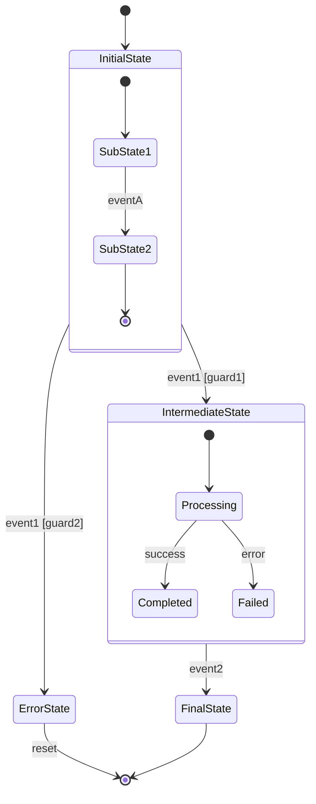
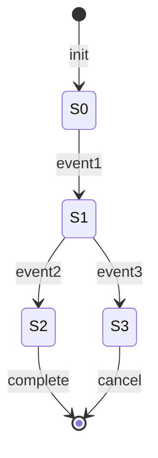

# 状态图模板

## 状态机概述
| 属性 | 内容 |
|-----|------|
| 状态机名称 | [name] |
| 状态机类型 | [Mealy/Moore/Hybrid] |
| 版本 | 1.0 |
| 创建日期 | YYYY-MM-DD |

## 状态定义

### 状态清单
| 状态ID | 状态名称 | 类型 | 描述 | 入口动作 | 出口动作 |
|-------|---------|------|-----|---------|---------|
| S-001 | Initial | [type] | [desc] | [entry] | [exit] |
| S-002 | [name] | [type] | [desc] | [entry] | [exit] |
| S-003 | Final | [type] | [desc] | [entry] | [exit] |

### 状态类型说明
- **Initial**: 初始状态
- **Final**: 终态
- **Intermediate**: 中间状态
- **Choice**: 判断状态
- **Fork**: 分叉状态
- **Join**: 合并状态

## 转换定义

### 转换表
| 转换ID | 源状态 | 目标状态 | 事件 | 守卫条件 | 动作 |
|-------|-------|--------|-----|---------|-----|
| T-001 | S-001 | S-002 | e1 | [guard] | [action] |
| T-002 | S-002 | S-003 | e2 | [guard] | [action] |

## 状态图 Mermaid 表示

## 简化状态图

## 状态转换条件矩阵

| 当前状态 \ 事件 | e1 | e2 | e3 |
|---------------|----|----|-----|
| S0 | S1 [g1] / a1 | - | - |
| S1 | - | S2 [g2] / a2 | S3 [g3] / a3 |
| S2 | - | - | - |
| S3 | - | - | - |

## 动作定义

### 入口动作
| 状态 | 动作 | 执行时机 |
|-----|-----|---------|
| S-001 | [action] | 进入状态时 |
| S-002 | [action] | 进入状态时 |

### 出口动作
| 状态 | 动作 | 执行时机 |
|-----|-----|---------|
| S-001 | [action] | 离开状态时 |
| S-002 | [action] | 离开状态时 |

### 转换动作
| 转换 | 动作 | 说明 |
|-----|-----|-----|
| T-001 | [action] | 执行 |
| T-002 | [action] | 执行 |

## 守卫条件定义

| 条件ID | 条件描述 | 表达式 |
|-------|---------|--------|
| G-001 | [desc] | [expression] |
| G-002 | [desc] | [expression] |

## 覆盖分析

### 状态覆盖
| 状态 | 覆盖次数 | 覆盖测试用例 |
|-----|---------|------------|
| S-001 | 1 | TC-001 |
| S-002 | 2 | TC-001, TC-003 |

### 转换覆盖
| 转换 | 覆盖次数 | 覆盖测试用例 |
|-----|---------|------------|
| T-001 | 1 | TC-001 |
| T-002 | 1 | TC-002 |

### 路径覆盖
| 路径ID | 路径 | 长度 | 覆盖测试用例 |
|-------|-----|-----|------------|
| P-001 | S0→S1→S2→end | 3 | TC-001 |
| P-002 | S0→S1→S3→end | 3 | TC-002 |

## 异常状态处理

| 异常类型 | 触发条件 | 当前状态 | 目标状态 | 处理动作 |
|---------|---------|---------|---------|---------|
| [type] | [condition] | [state] | [state] | [action] |
